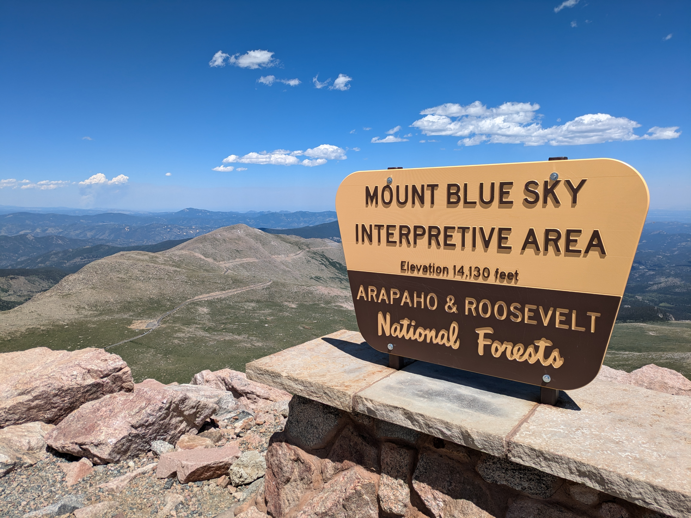

# 2026 Mt Blue Sky Workshop
This repository contains information for the [Wilsterman Lab](http://www.thewilstermanlab.com/) 2026 Mt. Blue Sky workshop.

# Workshops & Trapping Schedule

| Date | Schedule |
|---|---|
| 8/8 | **PM** — Introductory Meeting + High Altitude Physiology |
| 8/9 | **AM** — Arrive at Blue Sky    **PM** — Paths to Science + High Altitude Physiology    **PM** — Summit Trapping + High Altitude Physiology |
| 8/10 | **AM** — Mouse Processing at Summit    **AM** — Natural History and Ecology of High Alpine Environments in Colorado    **PM** — High Elevation Acclimatization and Adaptation |
| 8/11 | **AM** — Introduction to Behavioral Ecology    **PM** — Summit Trapping |
| 8/12 | **AM** — Mouse Processing at Summit    **PM** — High Altitude Physiology    **PM** — Introduction to R    **PM** — Summit Trapping |
| 8/13 | **AM** — Mouse Processing at Summit    **AM** — Introduction to Behavioral Ecology pt 2    **PM** — Data Wrangling in R |
| 8/14 | **AM** — Depart Blue Sky |
